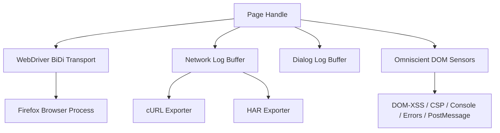

# Specification: `runtime-foxdriver`

## Overview

`runtime-foxdriver` provides low-level Firefox browser automation and event stream capture via WebDriver BiDi (`rustenium`). It operates as the foundation runtime primitive for Firefox-based scanning, automation, and stealth wrapping.

## Architecture

`runtime-foxdriver` abstracts Firefox processes and BiDi sessions into safe, async Rust handles.

### Components

1. **Process Lifecycle (`browser.rs`, `runtime.rs`)**
   - Readiness-polled TCP port binding (`reserve_local_port` + `launch_firefox_self_managed`).
   - Graceful SIGTERM shutdown prior to SIGKILL on Unix platforms (`request_graceful_terminate`) to force Firefox LSNG storage flush (`localStorage`/`IndexedDB`/cookies).

2. **Network Capture (`network.rs`)**
   - Passive event listeners for `BeforeRequestSent`, `ResponseCompleted`, and `FetchError`.
   - Ring buffer bounded by `max_entries` with incremental oldest-N eviction and first-time eviction warning logs (`eviction_warned`).
   - cURL export with single-quote shell parameter escaping (`to_curl`) preventing command-injection attacks via hostile header/method inputs.
   - HAR 1.2 exporter (`export_har` / `save_as_har`).

3. **JS Dialog & Download Tracking (`dialog.rs`)**
   - Captures `alert()`, `confirm()`, `prompt()`, `beforeunload`, and page-initiated downloads via `browsingContext.*` event subscriptions.
   - Non-blocking observation model (`DialogLog`).

4. **Frame Graph & Viewport Coordinate System (`frame_graph.rs`, `frame.rs`)**
   - Multi-origin OOPIF tree traversal via BiDi `browsingContext.getTree`.
   - `FrameGraph` snapshotting and parent-chain tracking (`ancestors_inclusive`, `deepest_captcha`).
   - Element coordinate translation (`frame_viewport_offset`) mapping nested iframe DOM rects to absolute main-viewport coordinates for trusted mouse interaction.

5. **Omniscient DOM Instrumentation (`sensors.rs`)**
   - Preload IIFE injection (`window.__meridian_signals__`) observing DOM-XSS sinks, console calls, uncaught JS errors, CSP violations, and cross-window `postMessage` calls.

## Invariants & Guarantees

1. **Safety & Lints**: Forbids unsafe code (`#![forbid(unsafe_code)]`). Denies `unwrap`, `expect`, `panic`, `todo`, and `unimplemented` in non-test code.
2. **Process Integrity**: Self-managed Firefox spawns guarantee graceful SIGTERM shutdown windows before SIGKILL fallback to eliminate zombie processes and profile corruption.
3. **Shell Escaping**: `CapturedRequest::to_curl` single-quotes method, URL, header keys/values, and request body payload with `'` -> `'\''` escaping to guarantee protection against command injection.
4. **Memory Bounding**: `NetworkLog` (default 50,000 entries) and `DialogLog` (default 1,000 entries) apply FIFO ring buffers to prevent memory exhaustion under high-throughput request loops.

## Testing & Verification

- `tests/unit`: Modular tests across frame graph traversal, cookie expiration, dialog capture, and network filtering.
- `tests/adversarial_hostile_capture.rs`: Command substitution, backtick breakout, and injection regression suite.
- `tests/webrtc_proxy_leak.rs`: WebRTC ICE candidate proxy enforcement checks.
- `tests/cross_origin_click.rs`: OOPIF coordinate calculation and click target resolution.
